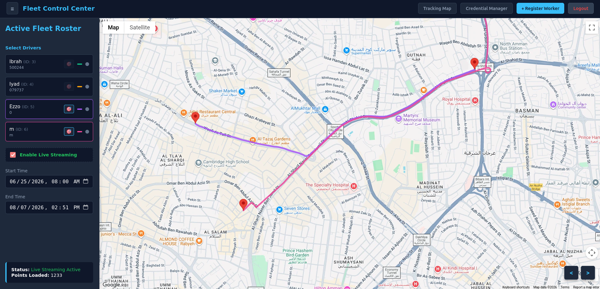
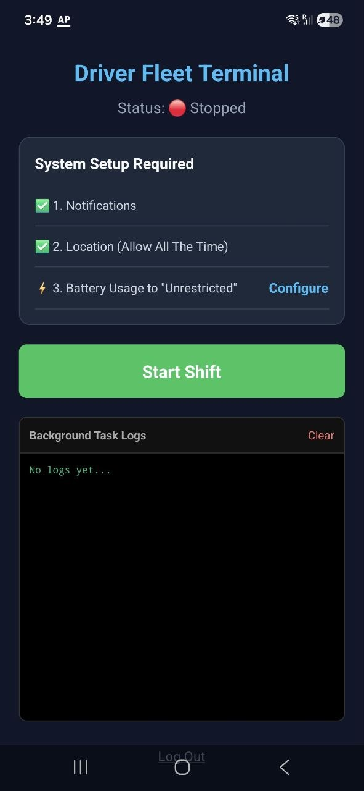
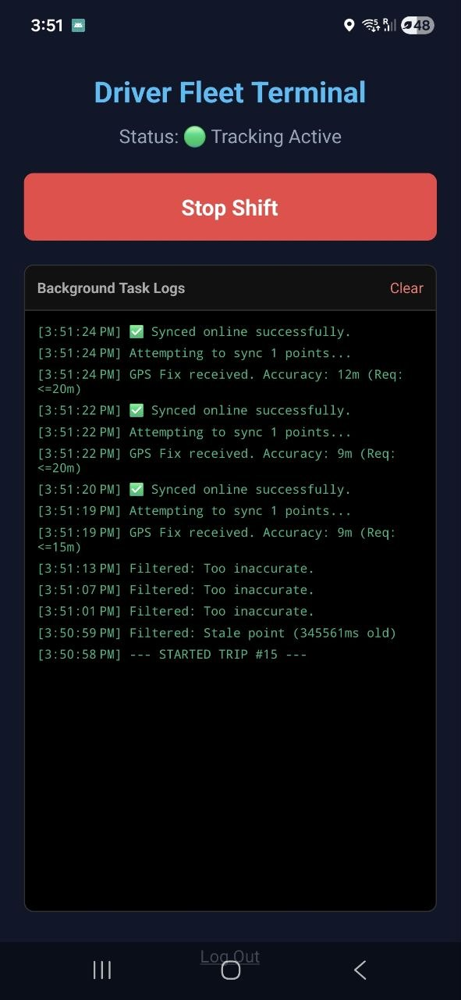

# Fleet Distribution Tracker

A high-throughput, real-time
fleet tracking system built with Spring Boot, PostgreSQL, React Native and Google Maps API.

## Manager Dashboard

## Driver App
 

## Current Features & Architecture
- **Trip Tracking:** Driver application creates new trips and uploads consistent location logs with timestamps.
- **Offline persistence:** The Driver application stores location logs in a queue and uploads them whenever the connection is recovered
- **Screen Off persistence:** The application sets OS level interrupt triggers to regularly wake up the application while the screen is off.
- **Accuracy filter:** The driver application filters out inaccurate logs.
- **Live and old trips:** The Manager Dashboard displays a map with trips done by selected drivers between given time points or shows all the trips from a time up until the current time including live trips.
- **Create new drivers:** Through Manager Dashboard
- **Multiple fleets:** users and their trips are grouped by fleet_id and can only access information about their fleet.

### Security
- **Spring Security:** Used to secure the application and manage authentication and authorization.
- **Role based Authorities:** Split authorities into Manager and Driver roles where a manager can manage drivers and view trips and drivers can create trips and log location.
- **Jwt Tokens:** Used to verify a user session and carry information that reduces database queries.

## Roadmap
- **Location Checklist:** Shows which locations the driver should visit and informs the manager whether the checklist was completed.
- **React Pivot:** Migrating to React to handle growing state complexity in the Manager Dashboard.
- **Interactive Map:** shows times upon hovering a trip or location log and opens a trip details box when clicking a trip.
- **New Driver map with routing recommendations**

## Tech Stack
- **Backend:** Java, Spring Boot, Spring Data JPA, Server-Sent Events (SSE)
- **Database:** PostgreSQL
- **Manager Dashboard:** Vanilla JS, Google Maps API, CSS3, HTML
- **Driver App:** React Native